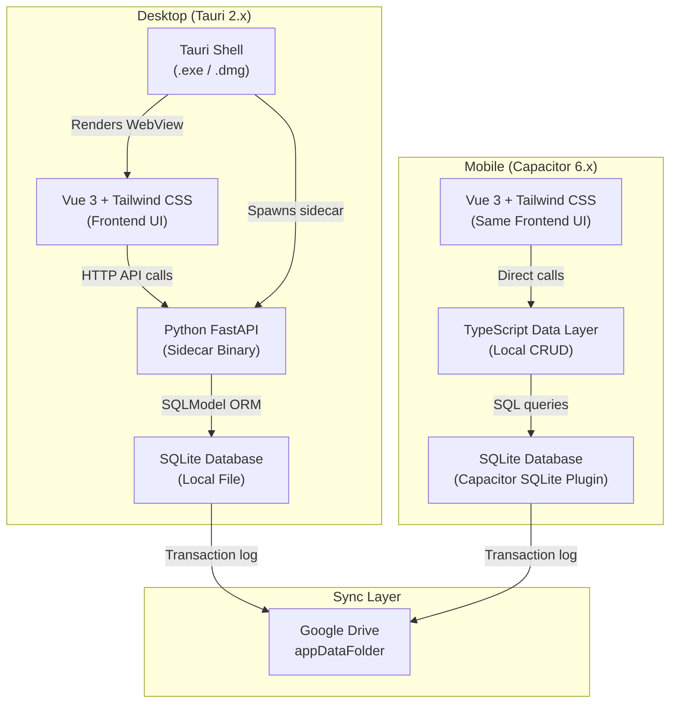

# Bird Aviary 2.0 — Implementation Plan

## Goal

Build an offline-first, cross-platform Bird Aviary Management application with 7 core modules (Birds in Stock, Sales, Breeding Chart, Soft Food, DNA Record, Reminders, Accounting), supporting desktop (Windows/macOS via Tauri) and mobile (Android via Capacitor), with Google Drive sync for multi-device usage.

---

## User Review Required

> [!IMPORTANT]
> **Tailwind CSS Version**: Your spec calls for Tailwind CSS. Should I use **Tailwind v4** (latest, CSS-first config, `@import "tailwindcss"`) or **Tailwind v3** (class-based config, `tailwind.config.js`)? Tailwind v4 is newer but has a different setup model. **I'll default to Tailwind v4 unless you say otherwise.**

> [!IMPORTANT]
> **Build Priority — Desktop First or Mobile First?** The shared Vue frontend works on both platforms, but the Python FastAPI sidecar only runs on desktop. For mobile, CRUD logic must be duplicated in TypeScript. I recommend **building desktop-first** (Phase 1–7) and adding the Capacitor mobile wrapper afterward (Phase 8), since the Vue frontend is identical — only the data layer differs. Does this approach work for you?

> [!WARNING]
> **Scope vs. Timeline**: This is a large application (7 modules, 12 database tables, cross-platform). Building everything end-to-end will take significant effort. I recommend we **build and validate Phase 1 (core architecture + Birds in Stock) first**, then iterate. This gives you a working app to test early and reduces risk of rework.

---

## Open Questions

> [!IMPORTANT]
> **1. Licensing Approach** — Do you want to implement licensing now, or defer it? Options:
> - **(a) Hand-rolled signed license file** (simple JSON blob signed with a private key, verified locally with a baked-in public key) — good for friends-only distribution
> - **(b) Keygen.sh / Lemon Squeezy** — good if this might become commercial
> - **(c) Defer** — skip licensing entirely for now and add it later

> [!IMPORTANT]
> **2. User Roles** — Does the owner need separate staff logins with restricted permissions (e.g., staff can log feeding/expenses but not delete records)? Or is this a single-user app for now?

> [!IMPORTANT]
> **3. Multi-Aviary Support** — Should the data model support multiple aviaries/locations from the start, or is this single-aviary only?

> [!IMPORTANT]
> **4. Data Export** — Should the owner be able to export records to Excel/PDF from day one? Or is this a later feature?

---

## Architecture Overview



### Key Architecture Decisions

| Decision | Choice | Rationale |
|---|---|---|
| **Frontend** | Vue 3 + Tailwind CSS + Vite | Shared across desktop & mobile; reactive, data-dense UI support |
| **Desktop backend** | Python FastAPI + SQLModel | Fast to build, Pydantic validation, native `WITH RECURSIVE` support |
| **Desktop packaging** | Tauri 2.x with Python sidecar | Lightweight native binary; Python compiled via PyInstaller/Nuitka |
| **Mobile packaging** | Capacitor 6.x | Wraps Vue frontend into Android APK; native camera/notification access |
| **Database** | SQLite (per-device) | Zero setup, supports recursive CTEs, ships inside installer |
| **Sync** | Google Drive `appDataFolder` | Append-only transaction log, no server cost, user-owned data |
| **Search** | SQLite trigram + `LIKE` | Character-level fuzzy matching without external search service |

---

## Project Structure (Monorepo)

```
BirdAviary2.0/
├── package.json                    # Root workspace config
├── vite.config.ts                  # Vite config (Tauri-aware)
├── tailwind.config.ts              # Tailwind CSS config
├── index.html                      # SPA entry point
├── tsconfig.json
│
├── src/                            # Vue 3 Frontend (shared desktop + mobile)
│   ├── main.ts                     # App entry
│   ├── App.vue                     # Root component
│   ├── router/
│   │   └── index.ts                # Vue Router config
│   ├── views/                      # Page-level components
│   │   ├── DashboardView.vue
│   │   ├── birds/
│   │   │   ├── BirdsListView.vue
│   │   │   ├── BirdProfileView.vue
│   │   │   ├── AddBirdView.vue
│   │   │   └── GenerationalView.vue
│   │   ├── breeding/
│   │   │   ├── PairsOverviewView.vue
│   │   │   ├── CreatePairView.vue
│   │   │   ├── BreedingRecordView.vue
│   │   │   └── BreedingAnalyticsView.vue
│   │   ├── sales/
│   │   │   ├── SalesListView.vue
│   │   │   └── MarkSoldView.vue
│   │   ├── dna/
│   │   │   └── DnaRecordsView.vue
│   │   ├── reminders/
│   │   │   └── RemindersView.vue
│   │   ├── softfood/
│   │   │   └── SoftFoodView.vue
│   │   └── accounting/
│   │       └── AccountingView.vue
│   ├── components/                 # Reusable UI components
│   │   ├── layout/
│   │   │   ├── AppSidebar.vue
│   │   │   ├── AppHeader.vue
│   │   │   └── AppLayout.vue
│   │   ├── birds/
│   │   │   ├── BirdCard.vue
│   │   │   ├── BirdSearchBar.vue
│   │   │   ├── CategoryFilter.vue
│   │   │   └── PedigreeTree.vue
│   │   ├── breeding/
│   │   │   ├── ClutchForm.vue
│   │   │   ├── ChickList.vue
│   │   │   └── PairStats.vue
│   │   └── shared/
│   │       ├── SearchInput.vue
│   │       ├── Modal.vue
│   │       ├── DataTable.vue
│   │       ├── StatCard.vue
│   │       └── PhotoUpload.vue
│   ├── composables/                # Vue 3 composables (shared logic)
│   │   ├── useApi.ts               # HTTP client for FastAPI backend
│   │   ├── useSearch.ts            # Fuzzy search logic
│   │   ├── useNotifications.ts     # Notification abstraction
│   │   └── useSync.ts             # Google Drive sync
│   ├── services/                   # Platform-specific service layer
│   │   ├── api.ts                  # Backend API client (desktop: HTTP, mobile: direct SQL)
│   │   ├── GoogleDriveSyncService.ts
│   │   └── authService.ts
│   ├── stores/                     # Pinia state management
│   │   ├── birdsStore.ts
│   │   ├── breedingStore.ts
│   │   ├── salesStore.ts
│   │   ├── remindersStore.ts
│   │   └── accountingStore.ts
│   ├── types/                      # TypeScript interfaces
│   │   └── index.ts
│   └── assets/
│       └── styles/
│           └── main.css            # Global styles + Tailwind imports
│
├── backend/                        # Python FastAPI Backend
│   ├── pyproject.toml              # Python dependencies (uv/poetry)
│   ├── main.py                     # FastAPI entry point (uvicorn)
│   ├── database.py                 # SQLite connection + SQLModel engine
│   ├── models/                     # SQLModel ORM models
│   │   ├── __init__.py
│   │   ├── bird.py
│   │   ├── category.py
│   │   ├── pairing.py
│   │   ├── clutch.py
│   │   ├── chick.py
│   │   ├── sale.py
│   │   ├── dna_record.py
│   │   ├── reminder.py
│   │   ├── soft_food.py
│   │   ├── expense.py
│   │   ├── sync_log.py
│   │   └── audit_log.py
│   ├── routers/                    # FastAPI route handlers
│   │   ├── __init__.py
│   │   ├── birds.py
│   │   ├── categories.py
│   │   ├── pairings.py
│   │   ├── breeding.py
│   │   ├── sales.py
│   │   ├── dna.py
│   │   ├── reminders.py
│   │   ├── soft_food.py
│   │   ├── expenses.py
│   │   └── sync.py
│   ├── services/                   # Business logic layer
│   │   ├── __init__.py
│   │   ├── bird_service.py
│   │   ├── breeding_service.py
│   │   ├── genealogy_service.py    # WITH RECURSIVE queries
│   │   ├── search_service.py       # Fuzzy search implementation
│   │   └── sync_service.py
│   └── migrations/                 # Schema versioning
│       └── init_schema.sql
│
├── src-tauri/                      # Tauri 2.x Desktop Shell
│   ├── Cargo.toml
│   ├── tauri.conf.json
│   ├── capabilities/
│   │   └── default.json
│   ├── binaries/                   # Compiled Python sidecar goes here
│   │   └── (api-x86_64-pc-windows-msvc.exe)
│   ├── icons/
│   └── src/
│       ├── lib.rs                  # Sidecar spawn + notification setup
│       └── main.rs
│
└── scripts/                        # Build & deployment scripts
    ├── build-sidecar.ps1           # PyInstaller/Nuitka build script
    └── build-apk.sh               # Capacitor Android build
```

---

## Database Schema

### Entity-Relationship Diagram

```mermaid
erDiagram
    CATEGORIES ||--o{ BIRDS : "has"
    BIRDS ||--o{ BIRDS : "father_of"
    BIRDS ||--o{ BIRDS : "mother_of"
    BIRDS ||--o{ PAIRINGS : "paired_as_a"
    BIRDS ||--o{ PAIRINGS : "paired_as_b"
    PAIRINGS ||--o{ CLUTCHES : "produces"
    CLUTCHES ||--o{ CHICKS : "hatches"
    CHICKS |o--o| BIRDS : "promoted_to"
    BIRDS ||--o| SALES : "sold_as"
    BIRDS ||--o{ DNA_RECORDS : "has"
    
    CATEGORIES {
        int id PK
        text name UK
        text description
    }
    
    BIRDS {
        int id PK
        text ring_id UK
        text name
        text mutation
        text photo_url
        text cage_number
        int category_id FK
        int father_id FK
        int mother_id FK
        text sex
        text status
        datetime created_at
        datetime updated_at
    }
    
    PAIRINGS {
        int id PK
        int bird_a_id FK
        int bird_b_id FK
        date start_date
        date end_date
        text cage_number
    }
    
    CLUTCHES {
        int id PK
        int pairing_id FK
        date clutch_date
        int total_eggs
        int fertile_eggs
        int eggs_lost
        text loss_reason
    }
    
    CHICKS {
        int id PK
        int clutch_id FK
        text ring_id UK
        text mutation
        text status
        text mortality_reason
        int promoted_bird_id FK
    }
    
    SALES {
        int id PK
        int bird_id FK
        date date_sold
        real sale_price
        text buyer_name
    }
    
    DNA_RECORDS {
        int id PK
        int bird_id FK
        text file_path
        text file_type
    }
    
    REMINDERS {
        int id PK
        text title
        text description
        datetime due_date
        text recurrence_pattern
        boolean notification_sent
    }
    
    SOFT_FOOD_LOGS {
        int id PK
        int year
        text season
        text recipe_name
        text ingredients
        text supplements
        text results
    }
    
    EXPENSES {
        int id PK
        int year
        int month
        date date
        text description
        real amount
    }
```



### Complete SQL Schema

```sql
-- Enable foreign keys (SQLite requires this per-connection)
PRAGMA foreign_keys = ON;

-- 1. Categories
CREATE TABLE categories (
    id INTEGER PRIMARY KEY AUTOINCREMENT,
    name TEXT NOT NULL UNIQUE,
    description TEXT,
    created_at DATETIME DEFAULT CURRENT_TIMESTAMP
);
CREATE INDEX idx_categories_name ON categories(name);

-- 2. Birds (self-referencing for genealogy)
CREATE TABLE birds (
    id INTEGER PRIMARY KEY AUTOINCREMENT,
    ring_id TEXT UNIQUE,
    name TEXT,
    mutation TEXT,
    sex TEXT CHECK(sex IN ('male', 'female', 'unknown')) DEFAULT 'unknown',
    photo_url TEXT,
    cage_number TEXT,
    category_id INTEGER,
    father_id INTEGER,
    mother_id INTEGER,
    status TEXT CHECK(status IN ('in_stock', 'sold', 'deceased')) DEFAULT 'in_stock',
    notes TEXT,
    created_at DATETIME DEFAULT CURRENT_TIMESTAMP,
    updated_at DATETIME DEFAULT CURRENT_TIMESTAMP,
    FOREIGN KEY(category_id) REFERENCES categories(id) ON DELETE SET NULL,
    FOREIGN KEY(father_id) REFERENCES birds(id) ON DELETE SET NULL,
    FOREIGN KEY(mother_id) REFERENCES birds(id) ON DELETE SET NULL
);
CREATE INDEX idx_birds_ring_id ON birds(ring_id);
CREATE INDEX idx_birds_name ON birds(name);
CREATE INDEX idx_birds_category_id ON birds(category_id);
CREATE INDEX idx_birds_father_id ON birds(father_id);
CREATE INDEX idx_birds_mother_id ON birds(mother_id);
CREATE INDEX idx_birds_status ON birds(status);

-- 3. Pairings (historical, a bird can have multiple partners)
CREATE TABLE pairings (
    id INTEGER PRIMARY KEY AUTOINCREMENT,
    bird_a_id INTEGER NOT NULL,
    bird_b_id INTEGER NOT NULL,
    start_date DATE NOT NULL,
    end_date DATE,
    cage_number TEXT,
    notes TEXT,
    created_at DATETIME DEFAULT CURRENT_TIMESTAMP,
    FOREIGN KEY(bird_a_id) REFERENCES birds(id) ON DELETE CASCADE,
    FOREIGN KEY(bird_b_id) REFERENCES birds(id) ON DELETE CASCADE
);
CREATE INDEX idx_pairings_birds ON pairings(bird_a_id, bird_b_id);

-- 4. Clutches (under a pairing)
CREATE TABLE clutches (
    id INTEGER PRIMARY KEY AUTOINCREMENT,
    pairing_id INTEGER NOT NULL,
    clutch_date DATE NOT NULL,
    total_eggs INTEGER DEFAULT 0,
    fertile_eggs INTEGER DEFAULT 0,
    eggs_lost INTEGER DEFAULT 0,
    loss_reason TEXT,
    notes TEXT,
    created_at DATETIME DEFAULT CURRENT_TIMESTAMP,
    FOREIGN KEY(pairing_id) REFERENCES pairings(id) ON DELETE CASCADE
);
CREATE INDEX idx_clutches_pairing_id ON clutches(pairing_id);

-- 5. Chicks (hatched → fledged → promoted to stock)
CREATE TABLE chicks (
    id INTEGER PRIMARY KEY AUTOINCREMENT,
    clutch_id INTEGER NOT NULL,
    ring_id TEXT UNIQUE,
    mutation TEXT,
    status TEXT CHECK(status IN ('hatched', 'fledged', 'deceased', 'added_to_stock')) DEFAULT 'hatched',
    mortality_reason TEXT,
    promoted_bird_id INTEGER,
    hatch_date DATE,
    fledge_date DATE,
    created_at DATETIME DEFAULT CURRENT_TIMESTAMP,
    FOREIGN KEY(clutch_id) REFERENCES clutches(id) ON DELETE CASCADE,
    FOREIGN KEY(promoted_bird_id) REFERENCES birds(id) ON DELETE SET NULL
);
CREATE INDEX idx_chicks_clutch_id ON chicks(clutch_id);

-- 6. Sales
CREATE TABLE sales (
    id INTEGER PRIMARY KEY AUTOINCREMENT,
    bird_id INTEGER NOT NULL,
    date_sold DATE NOT NULL,
    sale_price REAL NOT NULL,
    buyer_name TEXT,
    notes TEXT,
    created_at DATETIME DEFAULT CURRENT_TIMESTAMP,
    updated_at DATETIME DEFAULT CURRENT_TIMESTAMP,
    FOREIGN KEY(bird_id) REFERENCES birds(id) ON DELETE RESTRICT
);
CREATE INDEX idx_sales_bird_id ON sales(bird_id);
CREATE INDEX idx_sales_date ON sales(date_sold);

-- 7. DNA Records
CREATE TABLE dna_records (
    id INTEGER PRIMARY KEY AUTOINCREMENT,
    bird_id INTEGER NOT NULL,
    file_path TEXT NOT NULL,
    file_type TEXT CHECK(file_type IN ('image', 'pdf')) NOT NULL,
    created_at DATETIME DEFAULT CURRENT_TIMESTAMP,
    FOREIGN KEY(bird_id) REFERENCES birds(id) ON DELETE CASCADE
);
CREATE INDEX idx_dna_records_bird_id ON dna_records(bird_id);

-- 8. Reminders
CREATE TABLE reminders (
    id INTEGER PRIMARY KEY AUTOINCREMENT,
    title TEXT NOT NULL,
    description TEXT,
    due_date DATETIME NOT NULL,
    recurrence_pattern TEXT,
    is_active BOOLEAN DEFAULT 1,
    notification_sent BOOLEAN DEFAULT 0,
    created_at DATETIME DEFAULT CURRENT_TIMESTAMP,
    updated_at DATETIME DEFAULT CURRENT_TIMESTAMP
);
CREATE INDEX idx_reminders_due_date ON reminders(due_date);

-- 9. Soft Food Logs
CREATE TABLE soft_food_logs (
    id INTEGER PRIMARY KEY AUTOINCREMENT,
    year INTEGER NOT NULL,
    season TEXT CHECK(season IN ('spring', 'summer', 'autumn', 'winter')) NOT NULL,
    recipe_name TEXT NOT NULL,
    ingredients TEXT NOT NULL,
    supplements TEXT,
    results TEXT,
    created_at DATETIME DEFAULT CURRENT_TIMESTAMP
);
CREATE INDEX idx_soft_food_year ON soft_food_logs(year);

-- 10. Expenses (monthly accounting)
CREATE TABLE expenses (
    id INTEGER PRIMARY KEY AUTOINCREMENT,
    year INTEGER NOT NULL,
    month INTEGER NOT NULL CHECK(month BETWEEN 1 AND 12),
    date DATE NOT NULL,
    description TEXT NOT NULL,
    amount REAL NOT NULL,
    created_at DATETIME DEFAULT CURRENT_TIMESTAMP,
    updated_at DATETIME DEFAULT CURRENT_TIMESTAMP
);
CREATE INDEX idx_expenses_year_month ON expenses(year, month);

-- 11. Sync Log (append-only transaction log for Google Drive sync)
CREATE TABLE sync_log (
    id INTEGER PRIMARY KEY AUTOINCREMENT,
    device_id TEXT NOT NULL,
    table_name TEXT NOT NULL,
    record_id INTEGER NOT NULL,
    action TEXT CHECK(action IN ('INSERT', 'UPDATE', 'DELETE')) NOT NULL,
    payload TEXT,
    timestamp DATETIME DEFAULT CURRENT_TIMESTAMP,
    synced BOOLEAN DEFAULT 0
);
CREATE INDEX idx_sync_log_synced ON sync_log(synced);
CREATE INDEX idx_sync_log_timestamp ON sync_log(timestamp);

-- 12. Audit Log (change tracking)
CREATE TABLE audit_log (
    id INTEGER PRIMARY KEY AUTOINCREMENT,
    table_name TEXT NOT NULL,
    record_id INTEGER NOT NULL,
    action TEXT NOT NULL,
    old_values TEXT,
    new_values TEXT,
    timestamp DATETIME DEFAULT CURRENT_TIMESTAMP
);
CREATE INDEX idx_audit_log_table ON audit_log(table_name, record_id);
```

### Key Recursive Query — Generational Ancestry

```sql
-- Retrieve full ancestry tree for a given bird (bird_id = ?)
WITH RECURSIVE ancestor_tree(id, ring_id, name, mutation, father_id, mother_id, generation, lineage) AS (
    -- Base case: the target bird
    SELECT id, ring_id, name, mutation, father_id, mother_id, 0 AS generation, 'Self' AS lineage
    FROM birds WHERE id = ?

    UNION ALL

    -- Trace fathers
    SELECT b.id, b.ring_id, b.name, b.mutation, b.father_id, b.mother_id,
           a.generation + 1, a.lineage || ' → Father'
    FROM birds b
    JOIN ancestor_tree a ON b.id = a.father_id
    WHERE a.generation < 10  -- Cycle protection

    UNION ALL

    -- Trace mothers
    SELECT b.id, b.ring_id, b.name, b.mutation, b.father_id, b.mother_id,
           a.generation + 1, a.lineage || ' → Mother'
    FROM birds b
    JOIN ancestor_tree a ON b.id = a.mother_id
    WHERE a.generation < 10  -- Cycle protection
)
SELECT DISTINCT id, ring_id, name, mutation, generation, lineage
FROM ancestor_tree
ORDER BY generation ASC;
```

---

## Proposed Changes

### Phase 0 — Project Scaffolding & Core Architecture

Set up the monorepo, install all dependencies, and get the core architecture running end-to-end (Tauri shell → Python sidecar → SQLite → Vue frontend).

#### [NEW] Root project files
- `package.json` — workspace dependencies (Vue 3, Vite, Tailwind, Pinia, Vue Router)
- `vite.config.ts` — Tauri-aware Vite config
- `index.html` — SPA entry
- `tsconfig.json` — TypeScript config

#### [NEW] [main.css](file:///c:/Users/saadq/Desktop/BirdAviary2.0/src/assets/styles/main.css)
- Tailwind imports + global design tokens (color palette, typography, spacing)
- Dark mode support
- Custom component classes (cards, buttons, inputs, modals)

#### [NEW] [main.ts](file:///c:/Users/saadq/Desktop/BirdAviary2.0/src/main.ts)
- Vue 3 app initialization with Pinia + Vue Router

#### [NEW] [App.vue](file:///c:/Users/saadq/Desktop/BirdAviary2.0/src/App.vue)
- Root layout with sidebar navigation + router-view

#### [NEW] Python backend scaffold
- `backend/main.py` — FastAPI app with uvicorn, CORS middleware, CLI port argument
- `backend/database.py` — SQLite engine + session management via SQLModel
- `backend/models/` — All 12 SQLModel ORM models matching the schema above
- `backend/routers/` — Stub routers for each module
- `backend/pyproject.toml` — Dependencies (fastapi, uvicorn, sqlmodel, pydantic)

#### [NEW] Tauri 2.x shell
- `src-tauri/tauri.conf.json` — Bundle config with `externalBin` pointing to sidecar
- `src-tauri/capabilities/default.json` — Shell spawn + notification permissions
- `src-tauri/src/lib.rs` — Sidecar lifecycle management (spawn on startup, monitor stdout/stderr, graceful shutdown)

---

### Phase 1 — Birds in Stock (Core Module)

The foundational module — everything else depends on birds existing in the system.

#### [NEW] Backend routes: `backend/routers/birds.py`, `backend/routers/categories.py`
- `GET /api/birds` — list all birds with pagination, total count
- `GET /api/birds/{id}` — full bird profile with parent/sibling/pairing info
- `POST /api/birds` — add new bird (ring_id, photo, parents, siblings, category, cage)
- `PUT /api/birds/{id}` — update bird info
- `DELETE /api/birds/{id}` — soft delete (mark as deceased)
- `GET /api/birds/search?q=` — fuzzy character-level search (ring_id, name, category)
- `GET /api/categories` — list categories with bird counts
- `POST /api/categories` — add new category
- `GET /api/birds/{id}/pairings` — pairing history for a bird

#### [NEW] Backend service: `backend/services/search_service.py`
- Trigram-based fuzzy matching using SQLite `LIKE` with character-level tolerance
- Levenshtein distance calculation for ranking results

#### [NEW] Frontend views
- `src/views/birds/BirdsListView.vue` — all birds grid/list with count, category filter tabs
- `src/views/birds/BirdProfileView.vue` — full profile with parents, siblings, pairing history, DNA link
- `src/views/birds/AddBirdView.vue` — form with photo upload, parent/sibling selection, category picker
- `src/views/DashboardView.vue` — aviary overview dashboard with key stats

#### [NEW] Frontend components
- `src/components/birds/BirdCard.vue` — bird thumbnail card (photo, ring_id, mutation, status badge)
- `src/components/birds/BirdSearchBar.vue` — real-time fuzzy search with debounce
- `src/components/birds/CategoryFilter.vue` — horizontal tab/chip filter for categories
- `src/components/shared/SearchInput.vue` — reusable search input with loading state
- `src/components/shared/PhotoUpload.vue` — drag-drop or click-to-upload photo component
- `src/components/shared/Modal.vue` — reusable modal dialog
- `src/components/shared/DataTable.vue` — sortable, searchable data table
- `src/components/shared/StatCard.vue` — stat display card (count, label, icon)
- `src/components/layout/AppSidebar.vue` — navigation sidebar with module icons
- `src/components/layout/AppHeader.vue` — top bar with search + user actions
- `src/components/layout/AppLayout.vue` — master layout wrapping sidebar + header + content

#### [NEW] State management
- `src/stores/birdsStore.ts` — Pinia store for birds CRUD + search state
- `src/types/index.ts` — TypeScript interfaces for Bird, Category, Pairing, etc.

#### [NEW] Router
- `src/router/index.ts` — Vue Router with routes for dashboard, birds list, bird profile, add bird

---

### Phase 2 — Generational Record & Pairing History

Build on Phase 1 to add recursive ancestry views and historical pairing data.

#### [NEW] Backend service: `backend/services/genealogy_service.py`
- `WITH RECURSIVE` ancestor tree query (parents → grandparents → great-grandparents)
- `WITH RECURSIVE` descendant tree query (children → grandchildren)
- Depth-limited traversal with cycle protection

#### [NEW] Backend route additions: `backend/routers/birds.py`
- `GET /api/birds/{id}/ancestry` — recursive generational data (configurable depth)
- `GET /api/birds/{id}/descendants` — offspring tree

#### [NEW] Frontend views
- `src/views/birds/GenerationalView.vue` — interactive pedigree tree visualization

#### [NEW] Frontend components
- `src/components/birds/PedigreeTree.vue` — tree/chart component rendering multi-generation ancestry (parents → grandparents → great-grandparents), with clickable nodes linking to bird profiles

---

### Phase 3 — Breeding Chart (B1–B4)

The most complex module — pair creation, clutch tracking, chick pipeline, and analytics.

#### [NEW] Backend routes: `backend/routers/pairings.py`, `backend/routers/breeding.py`
- `POST /api/pairings` — create new pair (select male + female from stock, assign pair ID)
- `GET /api/pairings` — list all pairs with headline stats (total clutches, chicks fledged)
- `GET /api/pairings/{id}` — full pair detail with all clutches
- `PUT /api/pairings/{id}` — update pair (end date, cage number)
- `POST /api/pairings/{id}/clutches` — create new clutch under a pair
- `PUT /api/clutches/{id}` — update clutch (eggs, fertility, losses)
- `POST /api/clutches/{id}/chicks` — log hatched chicks
- `PUT /api/chicks/{id}` — update chick status (fledged, deceased with reason)
- `POST /api/chicks/{id}/promote` — **promote chick to stock** (creates bird record, links parent IDs)
- `GET /api/breeding/analytics` — best-performing pairs, totals by category, aviary-wide stats

#### [NEW] Backend service: `backend/services/breeding_service.py`
- Clutch → chick → stock promotion pipeline logic
- Auto-populate father_id/mother_id from pairing when promoting chick
- Analytics aggregation queries

#### [NEW] Frontend views
- `src/views/breeding/PairsOverviewView.vue` — all pairs with stats, "View Detail" buttons
- `src/views/breeding/CreatePairView.vue` — male/female search-and-select, pair ID assignment
- `src/views/breeding/BreedingRecordView.vue` — per-pair clutch timeline, chick tracking, fledge actions
- `src/views/breeding/BreedingAnalyticsView.vue` — charts: best pairs, totals by category, aviary-wide

#### [NEW] Frontend components
- `src/components/breeding/ClutchForm.vue` — form for eggs, fertility, losses
- `src/components/breeding/ChickList.vue` — chick status cards with promote/mark-deceased actions
- `src/components/breeding/PairStats.vue` — pair summary card (total clutches, eggs, fledged)

---

### Phase 4 — Sales

#### [NEW] Backend routes: `backend/routers/sales.py`
- `POST /api/sales` — mark bird as sold (updates bird status + creates sale record)
- `GET /api/sales` — sales log with pagination
- `GET /api/sales/search?q=` — search sales by ring_id, name, buyer
- `PUT /api/sales/{id}` — update sale details
- `GET /api/sales/analytics` — total revenue, sales by month/category

#### [NEW] Frontend views
- `src/views/sales/SalesListView.vue` — sales record log with search
- `src/views/sales/MarkSoldView.vue` — search bird from stock → capture sale details

#### [NEW] State management
- `src/stores/salesStore.ts` — Pinia store for sales

---

### Phase 5 — DNA Record & Reminders

#### [NEW] Backend routes: `backend/routers/dna.py`, `backend/routers/reminders.py`
- `POST /api/dna` — upload DNA certificate (image/PDF) for a bird
- `GET /api/dna/search?ring_id=` — find DNA record by ring ID
- `GET /api/dna/{id}/file` — serve DNA certificate file
- `POST /api/reminders` — create reminder (one-off or recurring)
- `GET /api/reminders` — list active reminders
- `PUT /api/reminders/{id}` — update reminder
- `DELETE /api/reminders/{id}` — delete reminder

#### [NEW] Frontend views
- `src/views/dna/DnaRecordsView.vue` — search + upload DNA certificates
- `src/views/reminders/RemindersView.vue` — reminder list with add/edit/delete

#### [NEW] Notification integration
- Desktop: Tauri notification plugin (`@tauri-apps/plugin-notification`)
- Background check on app launch: scan reminders where `due_date - 1 day <= now` and fire notifications

---

### Phase 6 — Soft Food & Accounting

#### [NEW] Backend routes: `backend/routers/soft_food.py`, `backend/routers/expenses.py`
- `POST /api/soft-food` — add soft food log entry
- `GET /api/soft-food?year=` — list by year/season
- `PUT /api/soft-food/{id}` — update entry
- `POST /api/expenses` — add expense
- `GET /api/expenses?year=&month=` — list expenses by month/year
- `PUT /api/expenses/{id}` — update expense
- `DELETE /api/expenses/{id}` — delete expense
- `GET /api/expenses/analytics` — totals per month, per year

#### [NEW] Frontend views
- `src/views/softfood/SoftFoodView.vue` — yearly log with season tags
- `src/views/accounting/AccountingView.vue` — monthly expense records + analytics charts

---

### Phase 7 — Cross-Module Analytics & Audit Trail

#### [MODIFY] Backend: add audit log middleware
- Automatic audit logging on every INSERT/UPDATE/DELETE across all tables
- `GET /api/audit-log?table=&record_id=` — view change history for any record

#### [NEW] Frontend: Dashboard enhancements
- Aviary-wide dashboard with:
  - Total birds in stock (by category)
  - Active breeding pairs
  - Total chicks fledged (this year / all time)
  - Recent sales
  - Upcoming reminders
  - Monthly expense summary

---

### Phase 8 — Google Drive Sync

#### [NEW] Backend routes: `backend/routers/sync.py`
- `GET /api/sync/pending` — get unsynced transaction log entries
- `POST /api/sync/mark-synced` — mark entries as synced after successful upload
- `POST /api/sync/replay` — replay downloaded transaction entries into local DB

#### [NEW] Frontend services
- `src/services/GoogleDriveSyncService.ts` — Google Drive `appDataFolder` REST API client
- `src/services/authService.ts` — Google OAuth flow (system browser redirect for Tauri)

#### [NEW] Tauri OAuth support
- `src-tauri/src/lib.rs` — OAuth localhost listener via `tauri-plugin-oauth`
- `src-tauri/capabilities/default.json` — add `opener:default` permission

---

### Phase 9 — Capacitor Mobile Build (Android)

#### [NEW] Capacitor configuration
- `capacitor.config.ts` — app config with plugin settings
- `android/` — generated Android project

#### [NEW] Mobile-specific data layer
- TypeScript SQLite service using `@capacitor-community/sqlite`
- Same API interface as the FastAPI backend, but runs SQL queries directly
- Camera plugin integration for bird photos + DNA certificates
- Local notifications via `@capacitor/local-notifications`

---

### Phase 10 — Polish, QA & Packaging

#### Desktop packaging
- PyInstaller script to compile Python backend → standalone `.exe`
- Tauri build with sidecar bundling → Windows installer (`.msi` / `.exe`)
- macOS build if needed (`.dmg`)

#### Mobile packaging
- Capacitor Android build → `.apk` for direct distribution

#### QA
- Edge case testing: multi-partner pairs, deep generational lookups, clutch pipeline
- Search accuracy testing with typos and partial input
- Offline operation verification

---

## Verification Plan

### Automated Tests

```bash
# Python backend unit tests
cd backend && python -m pytest tests/ -v

# Python API integration tests
cd backend && python -m pytest tests/integration/ -v

# Frontend unit tests (Vitest)
npx vitest run

# Type checking
npx vue-tsc --noEmit
```

### Manual Verification
- **Phase 0**: Verify Tauri app launches, sidecar starts, SQLite database is created, Vue frontend renders
- **Phase 1**: Add birds, search, view profiles, filter by category — verify all CRUD operations
- **Phase 2**: Create multi-generation test data, verify pedigree tree renders correctly
- **Phase 3**: Full breeding pipeline test: create pair → add clutch → log chicks → fledge → promote to stock
- **Phase 4**: Mark bird as sold, verify stock status updates, search sales records
- **Phase 5**: Upload DNA certificate, set reminder, verify notification fires
- **Phase 6**: Add expenses, verify monthly/yearly analytics
- **Phase 7**: Verify audit log captures all changes
- **Phase 8**: Sync between two desktop instances via Google Drive
- **Phase 9**: Run on Android emulator, test camera capture, verify local notifications
